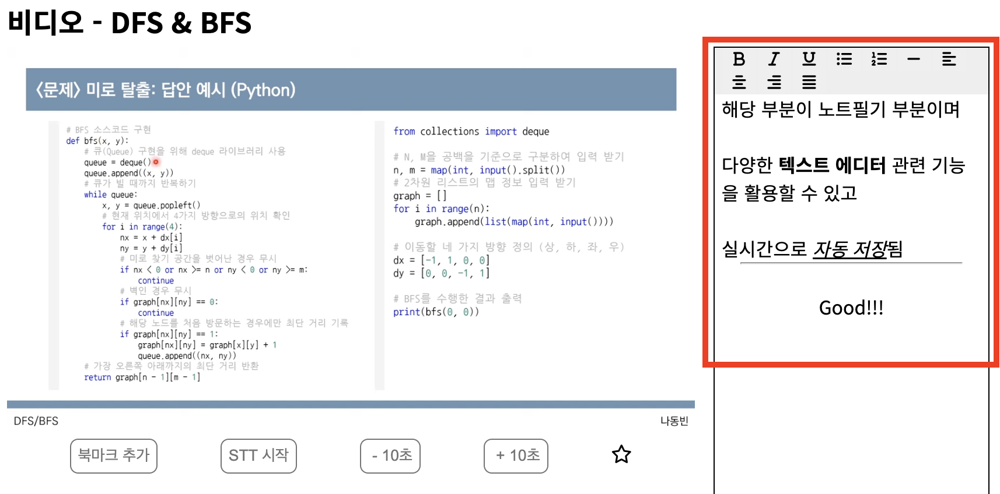

# [YouTIL] - Youtube 동영상 저장소

# 🌟 서비스 소개


**요약**

- 유튜브 동영상에 원하는 재생시간을 북마크로 추가하고 마지막으로 보던 위치를 이어서 볼 수 있도록 하는 등의 편의기능을 제공하는 웹사이트

**서비스 링크**

- [http://youtil.store](http://youtil.store)
- 테스트 계정
    - 문의 시 전달
- 현재 크롬 브라우저에 최적화

**개발 배경**

- 긴 유튜브 동영상을 보다가 실수로 나가는 경우, 마지막으로 보던 위치를 찾기 위해 영상을 계속해서 탐색해야 하는 점
- 다음에 또 보고 싶은 재생시간이 있는데 이를 간편하게 저장할 수 없는 점
- 유튜브 동영상을 통해 학습을 많이 하는데 영상과 필기를 따로 저장해둬야 하는 점

**사용 기술**
* Client - 


* Server - 


* Deploy - 


# 🌟 주요 기능

## 1. 이어보기 기능

**기능 요약**

- 동영상을 보다가 나가면 해당 재생시간 위치를 저장해 다음에 동영상을 재생하면 이어볼 수 있는 기능

**기능 상세**

- 동영상을 보다가 중간에 나가면 해당 재생시간 위치를 저장해 다음에 동영상 재생 시 해당 위치에서 이어서 재생할지 여부 모달로 확인
    - ‘이어보기’를 클릭한 경우 해당 위치로 동영상 시간 이동
    - ‘취소’를 클릭한 경우 처음부터 재생
- 최종 재생시간이 (총 동영상 길이 - 10초) 이상이면 재생시간 저장하지 않음
    - 메인페이지에 시청 중이던 동영상을 모아서 안내해주는 부분이 있기 때문에 해당 정책 설정

**구현 방식**

- 동영상을 재생, 혹은 멈출 시 해당 재생시간 위치 저장
- useEffect hook의 clean-up 기능을 이용해 다른 페이지로 이동 시 현재 재생시간 위치 저장하도록 설정

**사진 자료**

- 이어보기 모달
    
    
    
- 시청 중인 동영상 모음
    
    
    

## 2. 북마크 기능

**기능 요약**

- 원하는 재생위치를 북마크로 저장해둬서 언제든지 해당 위치를 재생해주는 기능

**기능 상세**

- 북마크를 저장하고 싶은 재생시간 위치에서 ‘북마크 추가’ 버튼 클릭 시 해당 재생시간이 ‘북마크 목록’에 추가됨
    - 북마크는 시간순으로 자동 오름차순 정렬을 함
- ‘북마크 목록’ 에 있는 북마크 시간을 클릭하면 해당 재생시간 위치로 이동함

**구현 방식**

- ‘[YouTube IFrame Player API](https://developers.google.com/youtube/iframe_api_reference?hl=ko)’ 를 활용하여 현재 동영상 재생위치 시간을 불러오는 함수 사용
- 같은 API에서 제공하는 특정 재생위치로 이동하는 함수 사용

**사진 자료**

- 북마크 추가 버튼과 저장된 북마크 목록들
    
    
    

## 3. 노트필기 기능

**기능 요약**

- 동영상을 보면서 노트필기를 작성할 수 있으며 자동저장 되는 기능

**기능 상세**

- 노트필기를 작성하면 자동저장되며 여러 가지 텍스트 에디터 관련 기능 제공

**구현 방식**

- 텍스트 에디터 관련 기능은 execCommand 함수를 활용하여 적용
- html 코드를 보여주는 부분은 ‘react-contenteditable’ 모듈 활용
- 혹시 모를 XSS 공격 방지를 위해 ‘DOMPurify’ 모듈을 활용해 필터링 된 텍스트 저장

**사진 자료**

- 노트필기 부분
    
    
    

## 4. 필기 내 STT 기능

**기능 요약**

- ‘STT 시작’ 버튼을 누르면 Speech To Text 기능이 실행되며 마이크를 통해 들어온 소리를 텍스트로 변환해 노트필기에 자동 추가

**기능 상세**

- ‘STT 시작’ 버튼을 클릭 시 마이크 동작이 시작되며 들어온 소리를 텍스트로 변환하여 노트필기 부분에 추가해줌
    - 음성이 잠시 중단되면 노트필기에 추가됨
    - ‘STT 중단’ 버튼을 클릭하면 노트필기에 추가됨

**구현 방식**

- ‘Web API’ 중 ‘Web Speech API’의 SpeechRecognition을 활용하여 기능 구현

**사진 자료**

- ‘STT 시작’ 버튼
    
    
    

## 5. 즐겨찾기 기능

**기능 요약**

- 즐겨찾기로 추가한 동영상은 따로 모아서 보여줌으로써 쉽게 다시 접근할 수 있도록 하는 기능

**기능 상세**

- 즐겨찾기로 추가한 경우 메인페이지에서 따로 모아서 보여줌
    - 해당 리스트에서 동영상을 클릭 시 ‘동영상 보기’ 페이지로 이동

**구현 방식**

- 동영상 하단의 별모양이 즐겨찾기 기능이며 토글 방식으로 작동

**사진 자료**

- 즐겨찾기 버튼 부분
    
    
    
- 즐겨찾기한 영상 모은 메인페이지
    
    
    

## 6. 카테고리별 동영상 정리

**기능 요약**

- 카테고리를 추가하여 하위에 원하는 동영상들을 추가해 정리할 수 있는 기능

**기능 상세**

- ‘재생목록 추가’ 를 하면 새로운 카테고리 생성 가능
    - 목록 삭제 가능
- ‘동영상 추가’ 를 하면 해당 재생목록에 동영상 추가 가능
    - 동영상 삭제 가능
- 동영상 이름 클릭 시 ‘동영상 보기’ 페이지로 이동

**사진 자료**

- 내 노트 목록
    
    
    

# 🌟 Troubleshooting 및 향후 개선 예정 사항

## 1. forEach 비동기작업 관련

**문제점**

- 아래와 같이 forEach를 활용하여 플레이리스트 안에 있는 동영상들을 DB에서 차례로 불러오는 코드 작성하였는데 데이터가 동영상들이 올바르게 불러와 지지 않는 현상 발생
    
    ```jsx
    playListRows.forEach((playListRow) => {
      const [videoRows] = await pool.query<video[]>(selectVideoAllByPlayListId, [playListRow.id]);
      if (videoRows.length > 0) {
        //video가 존재하는 경우
        data.push({
          id: playListRow.id,
          playListName: playListRow.playlistName,
          videoList: videoRows,
        });
      ...
    });
    ```
    

**원인**

- Array의 forEach 문의 경우 callback 함수에 대하여 배열요소를 돌면서 실행을 할 뿐 단순히 비동기라고 해서 callback이 끝날 때까지 기다리지 않음

**해결방법**

- for문으로 변경 진행하여 해결
    
    ```jsx
    for (let playListRow of playListRows) {
      const [videoRows] = await pool.query<video[]>(selectVideoAllByPlayListId, [playListRow.id]);
      if (videoRows.length > 0) {
        //video가 존재하는 경우
        data.push({
          id: playListRow.id,
          playListName: playListRow.playlistName,
          videoList: videoRows,
        });
     ...
    }
    ```
    

## 2. 새로고침 시 redux 데이터 사라져 로그인이 풀리는 문제

**문제점**

- 로그인을 한 뒤 새로 고침을 하면 redux의 사용자 정보 기반으로 화면 분기 처리한 부분이 문제 발생

**원인**

- 새로 고침을 하면 redux의 데이터들이 reset 되어 사용자 정보가 존재하지 않음

**해결방법**

- ‘redux-persist’ 모듈을 활용하여 redux의 사용자 정보를 localStorage에 저장하여 새로 고침을 해도 localStorage에 있는 데이터를 기반으로 redux의 사용자 정보를 상태관리 할 수 있도록 설정

## 3. 동영상 스크린샷 기능

**문제점**

- 동영상에서 특정 부분에서 스크린샷 버튼을 누르면 해당 화면을 캡처하는 기능을 구현하려고 했으나 실패

**원인**

- ‘html2canvas’ 라이브러리를 활용하여 스크린샷을 구현하려고 시도
    - html 코드를 스캔해 cavas element를 활용하여 스크린샷을 할 수 있게 해주는 라이브러리
    - Youtube 동영상은 iframe 안에서 실행되기 때문에 보안 정책상 iframe 내부 html은 접근 불가
- ‘Web API’ 중 ‘WebRTC’ 의 화면공유 기능을 통해 스크린샷 기능 구현하려고 시도
    - 해당 기능 활용 시 화면공유 선택 팝업이 뜨게 되어 사용하는데 제한적
    - 팝업이 안 뜨게 하는 것은 보안 정책상 불가

**해결방법**

- 해당 기능은 제외
- ‘Slid’ 라는 웹 어플리케이션 에서는 해당 기능을 제공하는 것을 확인하였는데 ‘Chrome plugin’을 활용하면 스크린샷 기능 구현이 가능한 것으로 확인
    - 차후 개선 예정 사항으로 추가

# 🌟 개선 예정 사항

## 1. 영상을 보다가 브라우저를 끄는 경우

**문제점**

- 현재 useEffect hook의 clean-up 기능을 활용해 다른 페이지로 이동하면 마지막 재생위치가 저장되지만, 브라우저 자체를 종료하면 저장이 되지 않는 문제

## 2. 브라우저 호환 polyfill

**문제점**

- 현재 Chrome을 기준으로 개발을 진행하여 타 브라우저 호환의 문제점 존재
    - dialog 태그, ‘[YouTube IFrame Player API](https://developers.google.com/youtube/iframe_api_reference?hl=ko)’ 지원 여부 등
- 브라우저 호환 관련 polyfill 적용 및 테스트 진행 예정

## 3. STT 진행 시 마이크 권한 확인

**문제점**

- 마이크 권한을 확인하는 팝업이 뜨지 않아 권한이 없으면 STT 불가한 문제점 존재
- 마이크 권한을 확인하는 팝업을 띄우고 동의하지 않으면 STT 불가함을 표시해주는 (혹은 STT 버튼 제거) 기능 추가 진행 예정